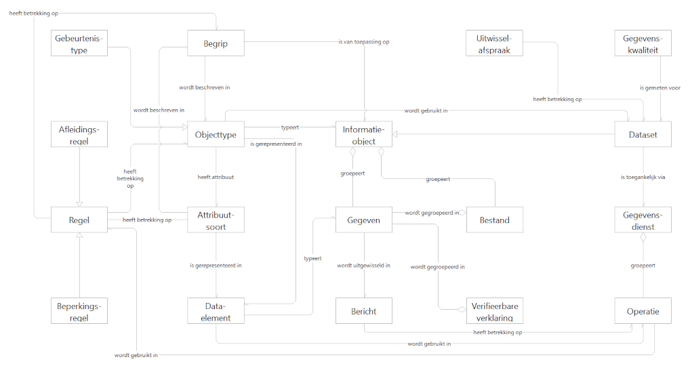
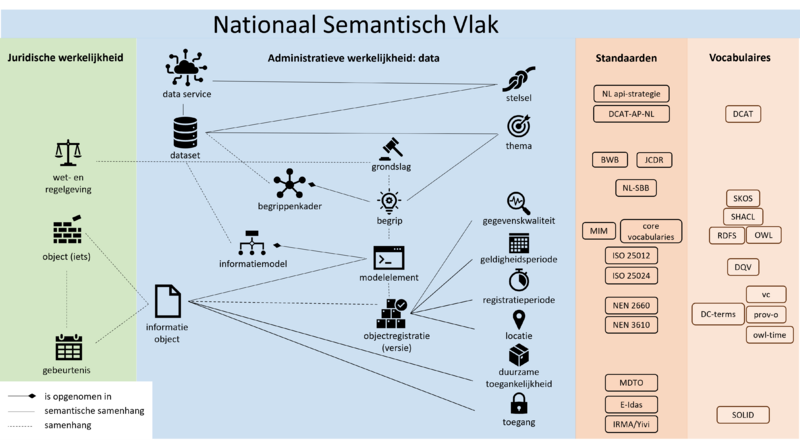
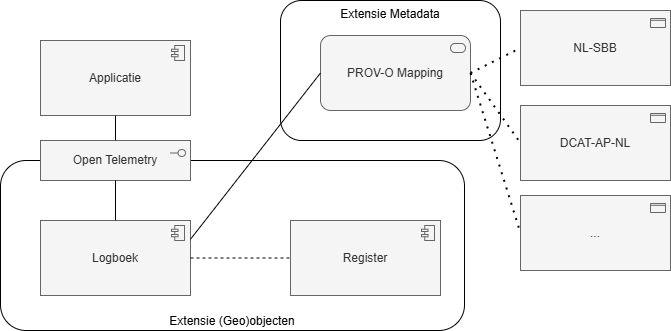

# Architectuur

De standaard Logboek dataverwerkingen gaat over het verantwoorden van het gebruik van informatie door de overheid. Hierbij moeten er keuzes gemaakt worden wat er wel en niet vastgelegd wordt. Het is immers in de praktijk niet haalbaar om elke individuele transactie of bevraging vast te leggen en daar nog waardevolle inzichten uit te kunnen halen. Deze 'implementatierichtlijnen' vallen buiten de scope van de standaard zelf. Hierdoor kan de standaard in principe heel breed ingezet worden.

## Huidige situatie

De standaard Logboek dataverwerkingen [[LDV]] beschrijft als werkingsgebied:

*Functioneel toepassingsgebied: De standaard Logboek dataverwerkingen moet worden toegepast als persoonsgegevens worden verwerkt ten behoeve van het ontsluiten van overheidsinformatie en/of functionaliteit.*

Dit kan beschouwd worden als een 'minimaal verplichte' scope.
De standaard is echter zo generiek opgesteld dat deze breder toegepast kan worden.

## Gewenste situatie

Bij de bredere toepassing van de standaard voor het loggen van (geo)objecten dienen zich een aantal aanvullende vragen aan. De uitwerking in dit document probeert antwoorden te geven op die aanvullende vragen.

Een van de vragen betreft het bepalen vanuit welk beleidskader het loggen van dataverwerkingen uitgevoerd wordt. De primaire scope van de standaard richt zich op het register van verwerkingsactiviteiten in het kader van de AVG. Bij het uitbreiden van de scope is het van belang te bepalen bij welke registers nog meer het loggen van dataverwerkingen als instrument ingezet kan worden. Voor dit onderzoek kiezen we voor het [Algoritmeregister](https://algoritmes.overheid.nl/nl) als kader om te bepalen of een verwerking gelogd moet worden of niet. De gedachte hierachter is dat het waardevol is om niet alleen te weten dat een algoritme ingezet wordt in een bepaalde beleidscontext, maar ook wanneer en op welke data dit algoritme dan is toegepast.

Met de uitbreiding van de scope van de te loggen verwerkingen wordt de semantische duiding van de verwerking en het object waar de verwerking op van toepassing is belangrijker. Daar waar de scope van een persoonsgegeven redelijk eenduidig is, kan de scope van een gelogd objectgegeven zeer divers zijn. Het kan gaan om een object uit een van de basisregistraties, maar ook een object uit een geheel andere dataset.

<aside class='example'><!-- markdownlint-disable-line -->
Als er uit de log blijkt dat er een object 'Station' gebruikt is, gaat het dan om een 'Waarnemingsstation' in de context van een sensor waarneming, of over een 'Treinstation' in de context van vertraging op het spoor?
</aside><!-- markdownlint-disable-line -->

Daarom is het voor het loggen van (geo)objectgegevens extra interessant om een uitbreiding op de standaard te realiseren die specificeert op welke manier het objectgegeven geïnterpreteerd moet worden. Voor deze uitbreiding denken we dat het meerwaarde heeft om de gegevens te kunnen definiëren in termen van de PROV-O-standaard [[PROV-O]]. Vanuit deze mapping is een verbinding naar bijvoorbeeld de [[NL_SBB]] of de [[DCAT_AP_NL]] standaard interessant.

## Positionering

### GDI Gegevensuitwisseling

[Bedrijfsobjectenmodel GDI Gegevensuitwisseling](https://minbzk.github.io/gdi-gegevensuitwisseling/?view=id-efc531031d114860a309f6eeacdad289)

De standaard Logboek dataverwerkingen kan gepositioneerd worden in de GDI Gegevensuitwisseling als standaard waarin een 'Uitwisselingsafspraak' geformaliseerd wordt. Waarbij de daadwerkelijke logging betrekking heeft op de 'Operatie'.

### NORA Nationaal Semantisch Vlak

[NORA Nationaal Semantisch Vlak](https://www.noraonline.nl/wiki/Nationaal_Semantisch_Vlak)

In het kader van het NORA Nationaal Semantisch Vlak kan de standaard Logboek dataverwerkingen gepositioneerd worden als het vastleggen van een gebeurtenis die betrekking heeft op een informatieobject.

## Aandachtsgebieden

De voorlopige conclusie is dat de kern van de standaard zodanig generiek is dat deze in principe ook toegepast kan worden voor het loggen van (geo)objecten.
De aandachtspunten liggen vooral in de te maken keuzes in de implementatie of het uitbreiden met een extensie voor inzage.

<aside class="note">

Vanuit het juridisch beleidskader [[JB_LDV]] wordt duidelijk dat `dpl.core.data_subject_id` alleen gebruikt dient te worden voor het verwijzen naar een persoonsgegeven. Bij het loggen van (geo)objecten maken we dan ook geen gebruik van `dpl.core.data_subject_id` maar definiëren we een extensie: `dpl.objects` om informatie over (geo)objecten te loggen. `dpl.core.data_subject_id` blijft leeg als er niet naar een persoonsgegeven verwezen wordt.
</aside>

### Implementatiekeuzes

Voor dit onderzoek kiezen we ervoor om de standaard te beproeven met een implementatie in een digitale tweeling.

[Digitale tweelingen zijn een praktisch hulpmiddel om alles wat bekend is over de leefomgeving, integraal inzichtelijk te maken.](https://www.geonovum.nl/themas/digital-twins) Een digitale tweeling wordt gevormd door een aantal bouwblokken. Door de functionaliteit van Logboek dataverwerkingen in te zetten in het bouwblok 'rekenen' leggen we data vast die gebruikt kan worden in het bouwblok 'vertrouwen'. Zie het rapport [Beleidsprocessen en bouwblokken voor Digitale Tweelingen](https://www.geonovum.nl/uploads/documents/Eindrapport%20Advies%20Beleid%20en%20Digital%20Twins%20-%20provincie%20Utrecht%20v1.3d.pdf) voor een uitleg van de verschillende bouwblokken.

Bij het onderzoek naar het implementeren van de standaard Logboek dataverwerkingen speelt de dynamiek van het ecosysteem van digitale tweelingen een grote rol. In de beoogde architectuur ontstaat er een catalogus (of 'appstore') van rekenmodellen die een gebruiker naar behoefte kan inzetten. Het is vooraf dus nog niet duidelijk welke organisatie welk aangeboden rekenmodel gaat inzetten voor het analyseren van een bepaald beleidsvraagstuk. De verwerkingsketen is daarmee op voorhand nog niet bekend en er is een scheiding van de verantwoordelijke organisatie en de aanbieder van het rekenmodel. Dit brengt implementatievraagstukken met zich mee waar we meer inzicht in willen krijgen.

Illustratieve indicatie van de verschillende bouwblokken in een ecosysteem van digitale tweelingen. Bron: Geonovum

### Afwegingskader

In de kern van de standaard wordt een [Register](https://logius-standaarden.github.io/logboek-dataverwerkingen/#register) gedefinieerd. Als de standaard toegepast wordt voor het loggen van persoonsgegevens wordt hier het register van verwerkingsactiviteiten in het kader van de AVG voor gebruikt. Voor het bepalen of een dataverwerking van een objectgegeven gelogd moet worden gaan wij in dit onderzoek uit van het Algoritmeregister als afwegingskader.

<aside class="note">

Als een organisatie dataverwerkingen doet in het kader van een algoritme dat in het Algoritmeregister is geregistreerd, dan zouden deze dataverwerkingen gelogd moeten worden op basis van deze standaard.
</aside>

### Volwassenheidsniveaus

Een ander aandachtspunt bij het beschrijven van de functionaliteit voor het loggen van objectgegevens betreft de volwassenheidsniveaus. Logging kan op verschillende volwassenheidsniveaus: hoe hoger het volwassenheidsniveau, hoe meer data er wordt gelogd.

Welk volwassenheidsniveau gebruikt wordt hangt van meerdere factoren af. De informatiebehoefte van de verantwoording, maar zeker ook wat er technisch gezien mogelijk is om te implementeren.

De volgende niveaus worden gehanteerd:

- Niveau 1: registerverwijzing
- Niveau 2: kolomverwijzing
- Niveau 3: concrete data

Zie [Detailniveaus](https://logius-standaarden.github.io/logboek-dataverwerkingen/#detailniveaus) in de standaard Logboek dataverwerkingen voor de verdere toelichting hierop.

## Extensies

In de standaard wordt de basisfunctionaliteit beschreven, en wordt een [extensieaanpak](https://logius-standaarden.github.io/logboek-dataverwerkingen/#extensies) beschreven om de standaard uit te breiden. 

Positionering extensies

### Extensie (geo)objecten

`dpl.core.processing_activity_id` is gereserveerd voor het verwijzen naar het register van verwerkingsactiviteiten in het kader van de AVG en `dpl.core.data_subject_id` is gereserveerd voor het verwijzen naar een persoonsgegeven.

__Voor het loggen van (geo)objectgegevens definiëren we de volgende extensie:
`dpl.objects`__

De uitwerking van de te gebruiken attributen in deze namespace staat in .

### Extensie Metadata

Om de interoperabiliteit tussen de standaard Logboek dataverwerkingen en andere systemen te verbeteren kijken we naar de mapping van het gebruikte model (op basis van OpenTelemetry) naar [[PROV-O]]. [[PROV-O]] wordt op diverse plaatsen, zowel nationaal als internationaal gebruikt om 'provenance' vast te leggen. 
  
Behalve naar [[PROV-O]] onderzoeken we ook de relatie naar de [[NL_SBB]] standaard, deze standaard voor het beschrijven van begrippen, wordt samen met [[DCAT_AP_NL]] bijvoorbeeld ingezet in het Federatief Datastelsel om metadata te beschrijven.

De mapping is uitgewerkt in . 
