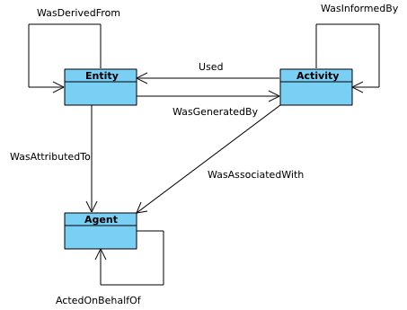
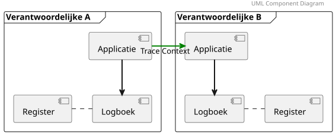
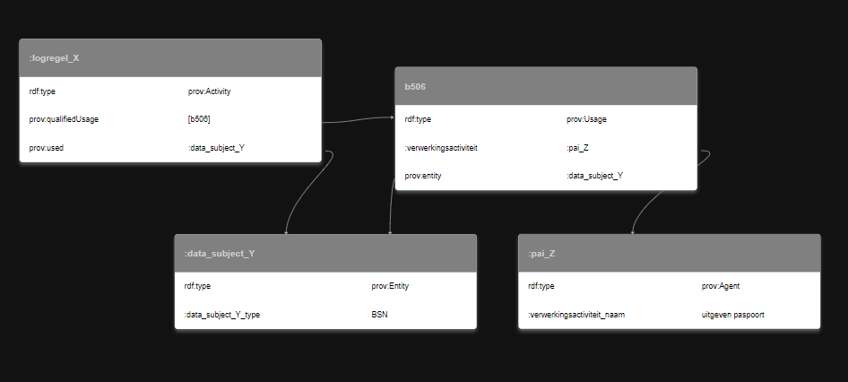
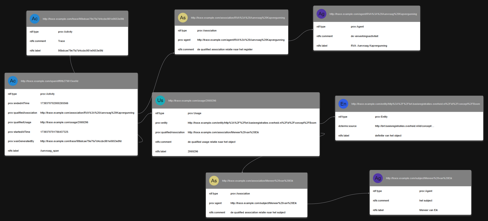

# Mapping naar PROV-O 


De kern van het [[PROV-O]]-model bestaat uit een Activiteit, een Entiteit en een Agent.



[Illustratie van het PROV-kernmodel](https://www.w3.org/TR/prov-dm/#prov-core-structures)

Om een goede mapping te kunnen maken tussen de standaard Logboek dataverwerkingen en PROV-O volstaat het kernmodel niet. We kijken daarom naar de complete ontologie om alle constructies goed te kunnen mappen.

De basis van de standaard kent het Logboek (met de [interface](https://logius-standaarden.github.io/logboek-dataverwerkingen/#interface) beschrijving), de Applicatie die naar het Logboek schrijft en het Register waarnaar verwezen wordt ter verantwoording van de verwerkingsactiviteit.



[Illustratie uit de standaard Logboek dataverwerkingen, componenten in context](https://logius-standaarden.github.io/logboek-dataverwerkingen/#fig-componenten-in-context)

Het Logboek is in essentie een lijst van PROV-O Activities. De data die bij zo'n activiteit gebruikt of gewijzigd wordt, waaronder het object waar de verwerking over gaat, is een PROV-O Entity. Een PROV-O Agent is de actor die de verwerking uitvoert; in de voorbeelden hieronder wordt ook de betrokkene als Agent gemodelleerd.
Zowel Agent als Entity komen niet rechtstreeks in het kernmodel van het logboek voor.

Als we een laag dieper kijken naar de [interface](https://logius-standaarden.github.io/logboek-dataverwerkingen/#interface) beschrijving vinden we daar echter wel aanknopingspunten voor een verdere mapping.

## Logboek Interface (Normatieve standaard)

```text
    Een van de gedefinieerde attributen is het veld `resource`. 
    Dit is een bericht, opgebouwd uit het volgende veld:

    - `attributes`: Lijst attributen in de vorm van *KeyValue pairs*. 
    De organisatie kan deze lijst gebruiken om een systeem, 
    applicatie of component aan te duiden op een manier die binnen de 
    organisatie gebruikelijk is. 
    Dit zijn bijvoorbeeld naam en versienummer van een applicatie, 
    of een verwijzing naar een record in een CMDB.

    Het veld `attributes` is een lijst van *key-value pairs*, 
    in een namespace met prefix `dpl.` (data processing log). 
    De volgende attributen zijn mogelijk in de namespace `core`:

    - `dpl.core.processing_activity_id`: URI; Verwijzing naar Register 
    met meer informatie over de Verwerkingsactiviteit
    - `dpl.core.data_subject_id`: Unieke identificerende code van de Betrokkene; versleuteld. 
    Hiermee wordt aangeduid welke persoon Betrokkene is bij de verwerking, gelet op de AVG.
    - `dpl.core.data_subject_id_type`: Type van het veld data_subject_id. 
    Dit is bijvoorbeeld BSN, Personeelsnummer of Vreemdelingennummer, 
    of een URI naar een Register waar het veld meer precies wordt geduid.
```

In de attributes zien we dus de constructie om te verwijzen naar het register via `dpl.core.processing_activity_id`. En we zien met `dpl.core.data_subject_id` een constructie om te verwijzen naar het subject van de verwerking, en met `dpl.core.data_subject_id_type` een nadere duiding van het soort subject.

Via een `prov:qualifiedUsage` relatie kan een Activiteit (dus een regel in het Logboek) gerelateerd worden aan een verwerkingsactiviteit in het Register.

```turtle
@prefix : <http://example.org/> .
@prefix prov: <http://www.w3.org/ns/prov#> .

:logregel_X a prov:Activity ;
    prov:used :data_subject_Y ;
    prov:qualifiedUsage [
        a prov:Usage ;
        prov:entity :data_subject_Y ;
        :verwerkingsactiviteit :pai_Z
    ] .

:data_subject_Y a prov:Entity ;
    :data_subject_Y_type "BSN" .

:pai_Z a prov:Agent ;
    :verwerkingsactiviteit_naam "uitgeven paspoort" .
```


Voorbeeld van qualified usage

De mapping van het technisch (OpenTelemetry-)model van de standaard Logboek dataverwerkingen naar PROV-O maakt het vervolgens makkelijker om de loggegevens interoperabel te maken met andere systemen.

## Logboek Interface (objecten)

Net zoals de core standaard attributen definieert in de `dpl.core` namespace, definiëren we attributen voor (geo)objecten in de `dpl.objects` namespace. 
Deze mapping is niet op dezelfde wijze te doen omdat we in de logging niet een individueel aanwijsbaar object vastleggen maar een lijst met objecten.

- optie: onderzoeken of het waardevol is een mapping naar MLDCAT-AP [[MLDCAT_AP]] te doen.
- optie: onderzoeken of het waardevol is een mapping naar [[DPROD]], Data Product Ontology te doen.


## Voorbeelduitwerking

Onderstaand een voorbeeld van een log vanuit OpenTelemetry:

```json
"spans": [
                        {
                            "traceId": "98bdcae79e7fa7d4ccbc981e0653e8fd",
                            "spanId": "dff0fb279813ee0d",
                            "parentSpanId": "",
                            "flags": 256,
                            "name": "Aanvraag_span",
                            "kind": 1,
                            "startTimeUnixNano": "1739370701786437325",
                            "endTimeUnixNano": "1739370702000265566",
                            "attributes": [
                                {
                                    "key": "dpl.objects.processing_association_id",
                                    "value": {
                                        "stringValue": "http://aanvraag"
                                    }
                                },
                                {
                                    "key": "dpl.core.processing_activity_id",
                                    "value": {
                                        "stringValue": "RVA: Aanvraag Kapvergunning"
                                    }
                                },
                                {
                                    "key": "dpl.objects.data_object_id",
                                    "value": {
                                        "intValue": "2069296"
                                    }
                                },
                                {
                                    "key": "dpl.objects.data_object_def",
                                    "value": {
                                        "stringValue": "http://brt.basisregistraties.overheid.nl/id/concept/Boom"
                                    }
                                },
                                {
                                    "key": "dpl.core.data_subject_id",
                                    "value": {
                                        "stringValue": "Meneer van Eik"
                                    }
                                }
                            ],
                            "status": {
                                "code": 1
                            }
                        }
                    ]                                                         
```

<aside class="note">

Dit voorbeeld komt uit een eerdere iteratie van de extensie. Het gebruikt nog attribuutnamen (`dpl.objects.processing_association_id`, `dpl.objects.data_object_id` en `dpl.objects.data_object_def`) die later zijn vervangen door de structuur uit [](#H3). Voor de leesbaarheid bevat `dpl.core.data_subject_id` hier een naam en `dpl.core.processing_activity_id` een omschrijving; volgens de standaard zijn dat respectievelijk een versleutelde identificatie en een URI.
</aside>

Met RML kan deze JSON-data geconverteerd worden naar RDF/Turtle.
> Zie de [introductie van RML](https://rml.io/docs/rml/introduction/) voor meer informatie over RML.

In de [Git repository](https://github.com/Geonovum/logboek-dataverwerkingen-voor-objecten/tree/main/prov-o_mapping) zijn het voorbeeld van de RML-transformatie, de input (JSON) en de output (Turtle) te vinden om bovenstaande log om te zetten naar RDF conform de PROV-O ontologie.

Deze trace zou er in RDF als volgt uit kunnen zien:

```turtle
@prefix dcterms: <http://purl.org/dc/terms/> .
@prefix prov: <http://www.w3.org/ns/prov#> .
@prefix rdfs: <http://www.w3.org/2000/01/rdf-schema#> .

<http://trace.example.com/span/dff0fb279813ee0d> a prov:Activity ;
    rdfs:label "Aanvraag_span" ;
    prov:endedAtTime "1739370702000265566" ;
    prov:qualifiedAssociation <http://trace.example.com/association/RVA%3A%20Aanvraag%20Kapvergunning> ;
    prov:qualifiedUsage <http://trace.example.com/usage/2069296> ;
    prov:startedAtTime "1739370701786437325" ;
    prov:wasGeneratedBy <http://trace.example.com/trace/98bdcae79e7fa7d4ccbc981e0653e8fd> .

<http://trace.example.com/agent/RVA%3A%20Aanvraag%20Kapvergunning> a prov:Agent ;
    rdfs:label "RVA: Aanvraag Kapvergunning" ;
    rdfs:comment "de verwerkingsactiviteit" .

<http://trace.example.com/association/Meneer%20van%20Eik> a prov:Association ;
    rdfs:comment "de qualified association relatie naar het subject" ;
    prov:agent <http://trace.example.com/subject/Meneer%20van%20Eik> .

<http://trace.example.com/association/RVA%3A%20Aanvraag%20Kapvergunning> a prov:Association ;
    rdfs:comment "de qualified association relatie naar het register" ;
    prov:agent <http://trace.example.com/agent/RVA%3A%20Aanvraag%20Kapvergunning> .

<http://trace.example.com/entity/http%3A%2F%2Fbrt.basisregistraties.overheid.nl%2Fid%2Fconcept%2FBoom> a prov:Entity ;
    rdfs:label "definitie van het object" ;
    dcterms:source "http://brt.basisregistraties.overheid.nl/id/concept/Boom" .

<http://trace.example.com/subject/Meneer%20van%20Eik> a prov:Agent ;
    rdfs:label "Meneer van Eik" ;
    rdfs:comment "het subject" .

<http://trace.example.com/trace/98bdcae79e7fa7d4ccbc981e0653e8fd> a prov:Activity ;
    rdfs:label "98bdcae79e7fa7d4ccbc981e0653e8fd" ;
    rdfs:comment "Trace" .

<http://trace.example.com/usage/2069296> a prov:Usage ;
    rdfs:label "2069296" ;
    rdfs:comment "de qualified usage relatie naar het object" ;
    prov:entity <http://trace.example.com/entity/http%3A%2F%2Fbrt.basisregistraties.overheid.nl%2Fid%2Fconcept%2FBoom> ;
    prov:qualifiedAssociation <http://trace.example.com/association/Meneer%20van%20Eik> .
```



<aside class="note">

Deze mapping is een eerste, illustratieve uitwerking. Bij verdere uitwerking verdienen de volgende punten aandacht:

- begin- en eindtijden als `xsd:dateTime` vastleggen in plaats van als tijdstempel in nanoseconden;
- de relatie tussen span en trace uitdrukken met bijvoorbeeld `prov:wasInformedBy` of `dcterms:isPartOf`; `prov:wasGeneratedBy` is bedoeld voor een Entity die door een Activity is gegenereerd;
- `prov:qualifiedAssociation` hoort bij een Activity en niet bij een `prov:Usage`.
</aside>