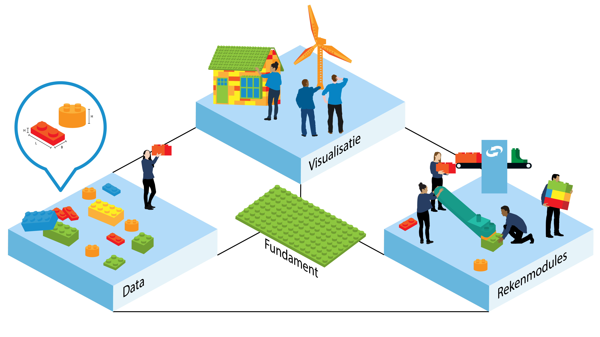
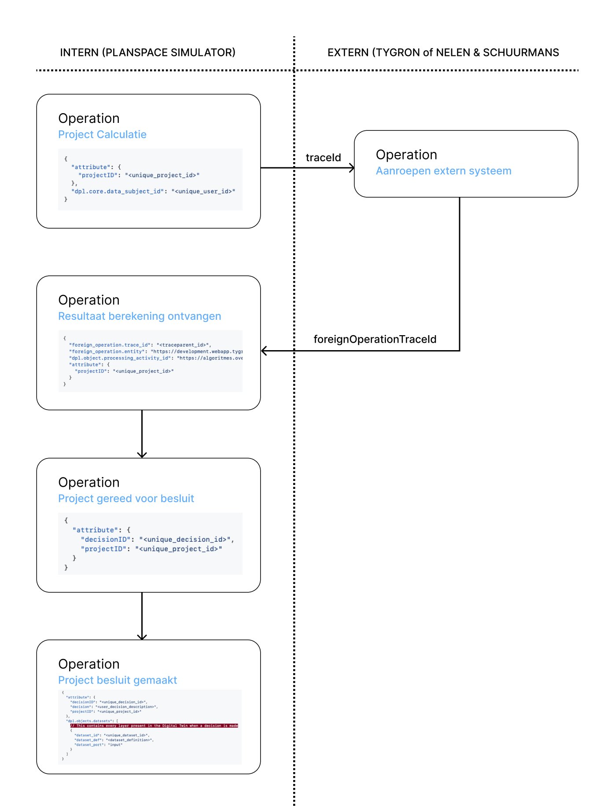
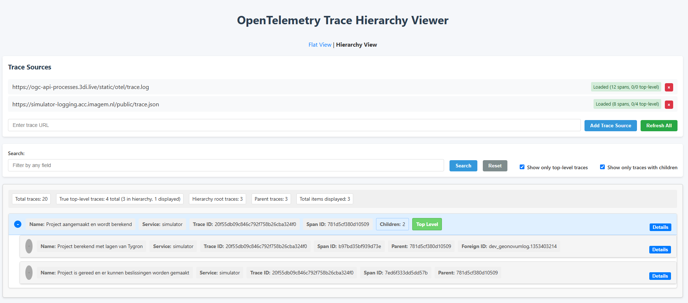

# Implementaties

## MVP met pygeoapi

In de [GitHub-repository](https://github.com/Geonovum/logboek-dataverwerkingen-voor-objecten/tree/main/mvp_pygeoapi_logging_demo) staat een Minimum Viable Product (MVP) waarin 
gedemonstreerd wordt hoe het OpenTelemetry-protocol geïmplementeerd kan worden in een OGC API Processes-functie.

__Use cases volwassenheidsniveaus__

Om de eigenschappen voor de extensie (geo)objecten goed uit te werken helpt het om te kijken naar een aantal voorbeelden en wat er dan gewenst is om vast te leggen.

### Remote-sensing-gebiedsclassificatie op basis van AI-beeldherkenning 

Dit is een voorbeeld waarbij een organisatie remote-sensingbeelden met AI-beeldherkenning verwerkt om gebieden te classificeren. Bijvoorbeeld om natuurgebieden te bepalen. 
In dit geval is er niet direct een betrokkene aan te wijzen (uiteindelijk heeft het gebied natuurlijk wel een eigenaar, maar de gegevens over de eigenaar worden niet direct gebruikt bij de classificatie van het gebied). 
Het is wel van belang om vast te leggen met welke batch remote-sensingbeelden deze analyse is uitgevoerd en welk algoritme gebruikt is. Beeldkwaliteit door bijvoorbeeld bewolking of 
een defect aan een sensor kunnen de classificatie beïnvloed hebben en dan wil je weten voor welke gebieden dit gevolgen heeft gehad.

Dit kan als Niveau 2: 'kolomverwijzing' beschouwd worden. Met dien verstande dat er verwezen wordt naar het type remote-sensingdata (bv Sentinel-2, LIDAR) en niet de gebruikte beeldwaarden 
van de remote-sensingbeelden. Er dient wel metadata van het gebruikte dataproduct vastgelegd te worden (timestamp, series) of een identifier die het specifieke dataproduct uniek identificeert.

minimale implementatie:

- dpl.objects.algorithm_id
- dpl.objects.dataproduct_id

<aside class="example">
dpl.objects.algorithm_id: Str(http://localhost/processes/Satellite_classifier)

dpl.objects.dataproduct_id: Str(http://localhost/collections/imagery/dune_images)
</aside>

uitgebreidere implementatie:

- dpl.objects.algorithm_id
- dpl.objects.dataproduct_id
- dpl.objects.dataset[
    - dataset_id
    - dataset_def
    - dataset_port (input)

],
- dpl.objects.dataset[
    - dataset_id
    - dataset_def
    - dataset_port (output)

]

<aside class="example">

```text
    dpl.objects.algorithm_id: Str(http://localhost/processes/Satellite_classifier)
    dpl.objects.dataproduct_id: Str(http://localhost/collections/imagery/dune_images)
    dpl.objects.dataset[
    {
        dataset_id: "image_1",
        dataset_def: Str(http://localhost/collections/imagery/dune_images/image_1),
        dataset_port: "input"
    },
    {
        dataset_id: "image_2",
        dataset_def: Str(http://localhost/collections/imagery/dune_images/image_2),
        dataset_port: "input"
    },
    {
        dataset_id: "image_out",
        dataset_def: Str(http://localhost/collections/imagery/output/image_out),
        dataset_port: "output"
    }
    ]
```
</aside>


### Maaidata-analyse: remote-sensingbeelden analyseren of percelen wel/niet gemaaid zijn

Dit is een voorbeeld van het verwerken van satellietbeelden om te signaleren of graslanden worden gemaaid tijdens het broedseizoen van beschermde vogelsoorten. 
Dit toezicht is van belang in verband met subsidieverstrekking voor natuurvriendelijk beheer. In deze analyse worden zowel remote-sensingbeelden gebruikt als percelen. 
Het resultaat van de analyse heeft een direct gevolg voor de eigenaar (betrokkene) van het perceel. (los van het feit dat er in de implementatie van het algoritme wel een menselijke check plaatsvindt)
Afhankelijk van de implementatie kan het ook nog zo zijn dat de analyse van de percelen zodanig gedaan wordt dat hier een betrokkene nog niet rechtstreeks te achterhalen is.

Dit kan als Niveau 2: 'kolomverwijzing' gelogd worden, maar zou ook als Niveau 3: 'concrete data' geïmplementeerd kunnen worden.

Niveau 2:

- dpl.core.processing_activity_id (verwijzing naar de subsidieverlening)
- dpl.core.data_subject_id (indien bekend in de verwerking van percelen)
- dpl.objects.algorithm_id (verwijzing naar het Algoritmeregister)
- dpl.objects.dataproduct_id 
- dpl.objects.dataset[
    - dataset_id
    - dataset_def
    - dataset_port 
]


<aside class="example">

```text
    dpl.core.processing_activity_id: Str(https://organisatie/rvva/subsidie_maaibeleid)
    dpl.core.data_subject_id: ""
    dpl.objects.algorithm_id: Str(http://localhost/processes/Maaidata_classifier)
    dpl.objects.dataproduct_id: Str(http://localhost/collections/imagery/satimage)
    dpl.objects.dataset[
    {
        dataset_id: "image_1",
        dataset_def: Str(http://localhost/collections/imagery/satimage/image_1),
        dataset_port: "input"
    },
    {
        dataset_id: "percelen_1",
        dataset_def: Str(http://localhost/collections/percelen),
        dataset_port: "input"
    },
    {
        dataset_id: "subsidie",
        dataset_def: Str(http://localhost/collections/subsidie),
        dataset_port: "output"
    }
    ]
```
</aside>


Niveau 3:

- dpl.core.processing_activity_id (verwijzing naar de subsidieverlening)
- dpl.core.data_subject_id (indien bekend in de verwerking van percelen)
- dpl.objects.algorithm_id (verwijzing naar het Algoritmeregister)
- dpl.objects.dataproduct_id
- dpl.objects.dataset[
    - dataset_id 
    - dataset_def
    - dataset_port
    - feature [
        - feature_id
        - feature_def

        - feature_attribute [
            - attribute_name
            - attribute_value
            - attribute_def
        ]
    ]
]

<aside class="example">

```text
    dpl.core.processing_activity_id: Str(https://organisatie/rvva/subsidie_maaibeleid)
    dpl.core.data_subject_id: "13j2ec27-0cc4-3541-9av6-219a178fcgh6"
    dpl.objects.algorithm_id: Str(http://localhost/processes/Maaidata_classifier)
    dpl.objects.dataproduct_id: Str(http://localhost/collections/imagery/satimage)
    dpl.objects.dataset[
    {
        dataset_id: "image_1",
        dataset_def: Str(http://localhost/collections/imagery/satimage/image_1),
        dataset_port: "input"
    },
    {
        dataset_id: "percelen_1",
        dataset_def: Str(http://localhost/collections/percelen),
        dataset_port: "input",
        feature: [
            {
                feature_id: "perceelnr",
                feature_def: Str(http://localhost/collections/percelen/perceelnr),
                feature_attribute: [
                    {
                        attribute_name: "perceelnr",
                        attribute_value: "28"
                    },
                    {
                        attribute_name: "maairegime",
                        attribute_value: "niet klepelen"
                    }
                ]
            }
        ]
    },
    {
        dataset_id: "subsidie",
        dataset_def: Str(http://localhost/collections/subsidie),
        dataset_port: "output"
    }
    ]
```
</aside>


### Aanvraag kapvergunning

Dit is een (fictief) voorbeeld waar een betrokkene een aanvraag voor een kapvergunning indient. Hierbij moet beoordeeld worden of de betreffende boom gekapt mag worden, of bijvoorbeeld een monumentale status heeft.
In dit geval is er zowel een betrokkene en een activiteit in het register van verwerkingsactiviteiten, als een aanwijsbaar object (de boom). 

Dit kan zowel als Niveau 2: 'kolomverwijzing', maar ook als Niveau 3: 'concrete data' gelogd worden. Het ligt daarbij wel voor de hand om Niveau 3 te kiezen omdat de boom direct aanwijsbaar is.

Niveau 3:

- dpl.core.processing_activity_id (verwijzing naar de verwerkingsactiviteit kapvergunning)
- dpl.core.data_subject_id (de aanvrager van de kapvergunning)
- dpl.objects.algorithm_id (verwijzing naar het Algoritmeregister)
- dpl.objects.dataproduct_id
- dpl.objects.dataset [
    - dataset_id 
    - dataset_def
    - dataset_port
    - feature [
        - feature_id
        - feature_def
        - feature_port

        - feature_attribute [
            - attribute_name
            - attribute_value
            - attribute_def
        ]
    ]
]

<aside class="example">

```text
    dpl.core.processing_activity_id: Str(https://organisatie/rvva/kapvergunning)
    dpl.core.data_subject_id: "13j2ec27-0cc4-3541-9av6-219a178fcgh6"
    dpl.objects.algorithm_id: Str(http://localhost/processes/beoordelen_aanvraag)
    dpl.objects.dataproduct_id: Str(http://localhost/collections/basisdata/bomen)
    dpl.objects.dataset[
    {
        dataset_id: "bomen",
        dataset_def: Str(http://localhost/metadata/basisdata/bomen),
        dataset_port: "input",
        feature: [
            {
                feature_id: "boom",
                feature_attribute: [
                    {
                        attribute_name: "identificatie",
                        attribute_value: "2069296"
                    }
                ]
            }
        ]
    }
    ]
```
</aside>


## Implementatie in tooling voor digitale tweelingen

Naast het MVP-voorbeeld en de use cases ter verdieping van de requirements voor de extensie doen we ook een beproeving in de implementatie in systemen voor digitale tweelingen. 
Deze beproeving dient vooral om de context zoals die in [](#implementatiekeuzes) is beschreven beter te begrijpen.

### Vraagstukken

- Kunnen we de loggingstandaard implementeren in de tooling van de leveranciers
- Kunnen we met de aanroep van API's tussen de systemen ook de tracecontext meegeven zodat logs aan elkaar te relateren zijn
- Kunnen we de rekenmodellen die in de systemen gebruikt worden goed genoeg vastleggen in het Algoritmeregister en kunnen we daar dan naar verwijzen

### Uitgewerkte scenario's

De scenario's worden geplaatst in de context van de [NLDT architectuur](https://geonovum.github.io/NLDT-Architectuur/). 
Deze architectuur kent een basispatroon zoals getoond in de volgende afbeelding:




#### Imagem

De Planspace Simulator-software van Imagem wordt hier gebruikt als visualisatiecomponent, waarbij rekenmodellen van Nelen & Schuurmans, en Tygron worden aangeroepen.
In de user interface van Imagem wordt een knop getoond waarmee een 'besluit' vastgelegd kan worden. De stappen om dit besluit vast te leggen bestaan uit het laden van de relevante datalagen, het aanroepen van een rekenmodel, het tonen van het resultaat van het rekenmodel en het vastleggen van de conclusie die uit de resultaten getrokken worden. 




Er wordt dus een logfile aangelegd waarbij de verschillende stappen als 'spans' vastgelegd worden. De aanroep van het rekenmodel initieert het aanleggen van een logfile op het platform van het rekenmodel, waarbij de tracecontext meegegeven wordt om de losse logfiles in een later stadium aan elkaar te kunnen relateren.

Een voorbeeld van de log zoals deze door Imagem is vastgelegd is [hier](https://github.com/Geonovum/logboek-dataverwerkingen-voor-objecten/blob/main/codesprint-resultaten/trace-imagem.json) te vinden.

Er zijn hierbij 2 verschillende implementaties gedaan:
- De aanroep van het hittestressmodel van Tygron wordt synchroon gedaan (het visualisatieplatform 'wacht op antwoord' en doet niets in de tussentijd).
- De aanroep van het overstromingsmodel van Nelen & Schuurmans wordt asynchroon gedaan (het visualisatieplatform kan in de tussentijd doorgaan met andere activiteiten en krijgt op een later moment een melding van het resultaat van het rekenmodel).

#### Nelen & Schuurmans

In de uitgewerkte scenario's acteert het 3Di platform van Nelen & Schuurmans als rekenmodel voor overstromingsberekeningen. (Nelen & Schuurmans heeft ook een eigen visualisatiecomponent, maar dat is in dit scenario niet ingezet).

De aanroep van het Imagem Planspace Simulator platform resulteert in het aanleggen van een logfile van de berekening, waarbij het trace_id van de aanroepende applicatie vastgelegd wordt om de logfiles op een later moment aan elkaar te kunnen relateren.

Er is hierbij gekeken naar het implementeren van de verschillende [volwassenheidsniveaus](#volwassenheidsniveaus) van logging en de wijze waarop een hoger volwassenheidsniveau (2/3) gelogd zou kunnen worden.

- de eerste implementatie is de mogelijkheid om in de log de uitgevoerde stappen te loggen op basis van de specificatie in dit document.
- de tweede implementatie is de mogelijkheid om in de log te verwijzen naar de interne log van het 3Di systeem, waar toch al alle details vastgelegd worden.

Het voordeel van de eerste implementatie is de vastlegging in de log ten behoeve van de verantwoording, maar dit vraagt extra implementatie-inspanning en veroorzaakt dubbele logging.
Het voordeel van de tweede implementatie is dat deze logging toch al gedaan wordt en alles bevat om een complete 'replay' van het model uit te voeren. Dit is alleen wel een platformspecifieke implementatie en daarmee minder direct toegankelijk voor verantwoording.

Een voorbeeld van de log zoals deze door Nelen & Schuurmans is vastgelegd is [hier](https://github.com/Geonovum/logboek-dataverwerkingen-voor-objecten/blob/main/codesprint-resultaten/trace-nelen_schuurmans.json) te vinden.

Behalve de implementatie van de logging heeft Nelen & Schuurmans ook een Proof-of-Concept opgeleverd van een 'logviewer', een applicatie om de verschillende logfiles aan elkaar te relateren en een integraal beeld te geven van de gevolgde stappen.



#### Tygron

Het platform van Tygron is ingezet als rekenmodel, waarbij de aanroep vanuit het Imagem Planspace Simulator platform gebeurt. Hier wordt een logfile aangelegd waarbij het trace_id vanuit de aanroepende applicatie vastgelegd wordt om de logfiles op een later moment aan elkaar te kunnen relateren. In deze implementatie is vooral gekeken naar de compleetheid van de attributen zoals die gedefinieerd zijn in deze handreiking. 

Een voorbeeld van de log zoals deze door Tygron is vastgelegd is [hier](https://github.com/Geonovum/logboek-dataverwerkingen-voor-objecten/blob/main/codesprint-resultaten/trace-tygron.json) te vinden.

Daarnaast is er een scenario uitgewerkt waarbij het Tygron platform gebruikt wordt als zowel visualisatiecomponent als rekenmodel. Dit scenario onderstreept het verschil in benadering van het gebruik van een digitaletweelingtoepassing en het vastleggen van een besluit vanuit het oogpunt van de verantwoording.

### Bevindingen

Tijdens het implementeren in de tooling zijn de volgende onderwerpen naar boven gekomen.

#### Verschil in invalshoek tussen loggen vanuit verantwoording en gebruik van platformen voor digitale tweelingen

Een van de belangrijkste vraagstukken tijdens de implementatie was de 'variabiliteit' waarvoor een platform voor digitale tweelingen ingezet wordt. Er is in de regel niet een specifiek vastgelegd werkproces of stappenplan om tot een bepaalde beleidsbeslissing te komen. Hiermee wordt het ingewikkeld om in de logging specifiek af te bakenen welk deel te relateren is aan een specifiek algoritme of het tot stand komen van een besluit.

Dit is geadresseerd door in het platform van Imagem een specifieke knop te maken die het stappenplan tot het nemen van een besluit initieert. Of dit in de praktijk werkt, is niet verder onderzocht.

Ter illustratie is in het platform van Tygron een log aangelegd die de standaard gang van zaken van het gebruik van het platform logt. (initiëren omgeving, laden data, laden modellen, uitvoeren scenario's, visualiseren resultaten). 

#### Verantwoording, transparantie en herleidbaarheid

De standaard Logboek dataverwerkingen redeneert sterk vanuit de juridische beleidscontext en de verantwoording van dataverwerkingen op basis hiervan. 
Voor de scope van de originele standaard past dit goed bij het registreren van verwerkingen op basis van het register van verwerkingsactiviteiten gerelateerd aan persoonsgegevens.

In de praktijk blijkt het niet triviaal om de dynamiek van het werken met digitale tweelingen eenduidig aan specifieke dataverwerkingen te relateren (zie ook [](#verschil-in-invalshoek-tussen-loggen-vanuit-verantwoording-en-gebruik-van-platformen-voor-digitale-tweelingen)), de term verantwoording lijkt dan niet altijd passend. De transparantie en herleidbaarheid van dataverwerkingen in de verschillende platformen wordt echter wel als heel belangrijk beschouwd. De platformen hebben in de praktijk dus veelal logging ingebouwd om dataverwerkingen te kunnen herleiden en inzicht te geven in de gevolgde stappen. 

#### Doelgroep voor Logging

Het inzicht dat de standaard Logboek dataverwerkingen geeft in de context van de AVG is in principe rechtstreeks relevant voor betrokken personen. In de scenario's die uitgewerkt zijn in de fysieke leefomgeving zijn de expertmodellen die gebruikt worden een stuk lastiger te interpreteren. Het ontsluiten van deze logs zou daarom misschien niet rechtstreeks naar burgers moeten zijn, maar naar 'experts' die de context van het model kunnen interpreteren.

#### Tracecontext: één overkoepelend trace_id of per systeem een eigen trace_id

Bij het implementeren van de tracecontext over systemen heen kwam een onduidelijkheid in de specificatie naar boven. Het standaard gedrag van een OpenTelemetry SDK implementatie is het overnemen van hetzelfde trace_id in de verschillende applicaties. In de [LDV-specificatie](https://logius-standaarden.github.io/logboek-dataverwerkingen/#interface) staat dat de applicatie van een andere organisatie het trace_id van de aanroepende applicatie moet vastleggen in een 'foreign_operation.trace_id'. Dit kan geïmplementeerd worden maar vergt een specifieke implementatie, afwijkend van het standaard gedrag.

#### Granulariteit van verantwoording: register versus modules in de tooling

Bij het bepalen van het [afwegingskader](#afwegingskader) voor de implementatie van Logboek dataverwerkingen voor (geo)objecten is gekozen om te verwijzen naar het Algoritmeregister. Er zijn [3 algoritmes](https://algoritmes.overheid.nl/nl/algoritme?page=1&organisation=Stichting+Geonovum) opgenomen in het Algoritmeregister ten behoeve van dit onderzoek. 

Tijdens de implementatie van de logging in de platformen blijkt dat er vaak meerdere stappen gerelateerd zijn aan het algoritme zoals dat vastgelegd is in het register. Dit geeft ruimte voor interpretatieverschillen welke stappen wel of niet onderdeel zijn van het algoritme zoals het geregistreerd staat in het register.

#### Dynamiek in gebruik van systemen voor digitale tweelingen

Het ecosysteem van digitale tweelingen werkt toe naar een omgeving waar organisaties 'naar behoefte' een rekenmodel aan kunnen roepen als SaaS (Software as a Service) dienst. Dit roept het vraagstuk op dat een leverancier van een rekenmodel (zoals Nelen & Schuurmans of Tygron) van tevoren niet noodzakelijk weet welke organisaties een dienst gaan afnemen. Om toch een log vast te kunnen leggen van verwerkingen in de context van een vooraf nog onbekende organisatie moet er het nodige geregeld worden in de wijze waarop de SaaS dienst aangeboden wordt. De consequenties hiervan zijn op dit moment nog onduidelijk.

#### Loggen in LDV log of verwijzen naar systeemlog

De rekenmodellen leggen standaard in hun implementaties al een uitgebreide log aan waarmee de scenario's opnieuw opgebouwd of afgespeeld kunnen worden. Dit is leverancierspecifiek ingericht. De platformen zijn zeer flexibel en dynamisch ingericht waardoor het niet triviaal is om vast te leggen welke gegevens er op een gegeven moment betrokken zijn bij het komen tot een besluit. Om al deze gegevens via Logboek dataverwerkingen voor (geo)objecten vast te leggen is daarmee ook een complexe opgave. De vraag dient zich aan of de hogere volwassenheidsniveaus haalbaar zijn om te implementeren, en of het verwijzen naar de implementatiespecifieke systeemlogs een oplossing zou kunnen zijn. 

#### Granulariteit in het Algoritmeregister en juridische kaders

De algoritmes zoals deze nu in het Algoritmeregister zijn vastgelegd kunnen op basis van [verschillende wettelijke grondslagen ingezet worden](https://algoritmes.overheid.nl/nl/algoritme/modelleringssoftware-hittestress-stichting-geonovum/21577420#verantwoordGebruik). Hittestress kan bijvoorbeeld zowel een onderwerp zijn in het kader van planvorming en vergunningverlening in het kader van de Omgevingswet, maar het kan ook onderdeel zijn van het monitoren van gevaarlijke situaties op basis van de Algemene wet bestuursrecht.

De vraag dient zich dus aan of, en op welke wijze we dat onderscheid kunnen maken in de logging in de applicaties. Mogelijk is hierdoor alsnog onvoldoende duidelijk op welke gronden besluiten genomen zijn en daarmee neemt de waarde van de logging significant af. 

Een mogelijke oplossing zou kunnen zijn om een extra eigenschap op te nemen in de logging om expliciet te maken in het kader van welke wet een bepaalde dataverwerking is gedaan. Hoe dit exact zou moeten en welke consequentie dit voor de werkprocessen zou hebben is nog niet uitgewerkt tijdens dit onderzoek.

#### Voorstel aanvullende eigenschap om op te nemen in de log

Behalve de verwijzing naar een formele catalogus of het Algoritmeregister hebben platformleveranciers vaak ook een plek waar documentatie of aanvullende informatie van een rekenmodel of algoritme te vinden is. Hiervoor nemen we een aanvullende eigenschap op: `dpl.objects.vendor_operation_ref`.

#### processing_activity_id gelijk houden over namespaces heen of specifiek houden

Het kan verwarrend zijn om dezelfde eigenschap (processing_activity_id) in verschillende namespaces te hebben. We kiezen ervoor om de verwijzing naar een register zo expliciet mogelijk te maken. En daarom kiezen we ervoor om dpl.objects.processing_activity_id te hernoemen naar dpl.objects.algorithm_id.
